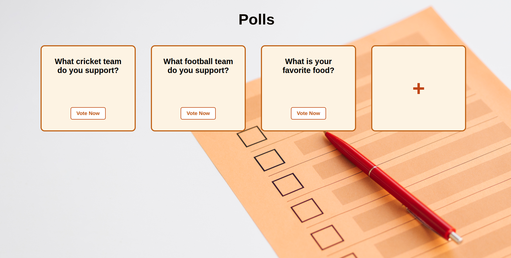
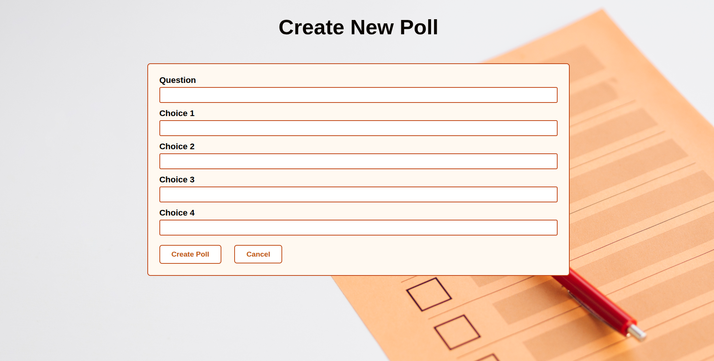
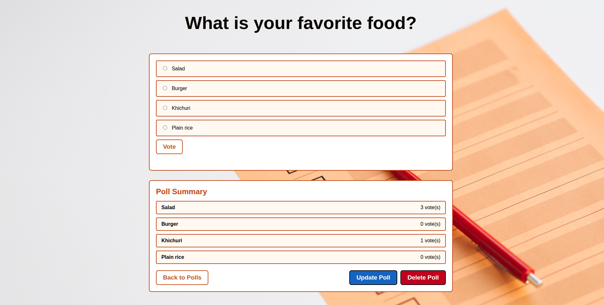
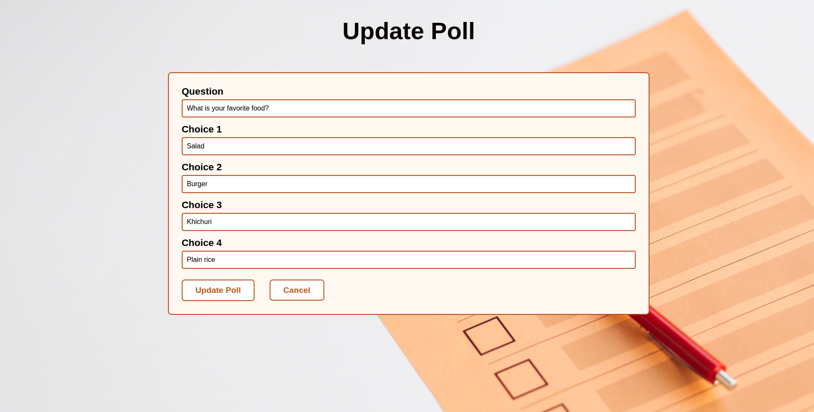
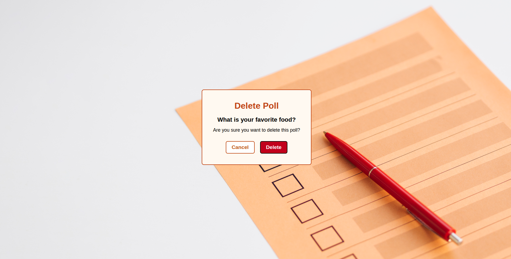

# Django Poll App

A simple polling application built with Django. Users can create polls, vote on them, and view results in real-time.

## Tech Stack

- **Backend:** Django (Python)
- **Frontend:** HTML, CSS
- **Database:** SQLite (default)

## Features

### Poll Index

View all available polls in a card-based layout. Click "Vote Now" to participate or use the "+" card to create a new poll.



### Create Poll

Create a new poll by entering a question and up to four choices.



### Poll Details and Voting

Vote on a poll and view the poll summary with live vote counts.



### Update Poll

Edit an existing poll's question and choices.



### Delete Poll

Remove a poll with a confirmation dialog.



## Getting Started

1. Clone the repository
2. Navigate to the project directory
3. Run migrations:
   ```bash
   python manage.py migrate
   ```
4. Start the development server:
   ```bash
   python manage.py runserver
   ```
5. Open `http://127.0.0.1:8000/polls/` in your browser

## Project Structure

```
djangotutorial/
├── manage.py
├── mysite/          # Project settings
└── polls/           # Polls application
    ├── models.py    # Question and Choice models
    ├── views.py     # View logic
    ├── urls.py      # URL routing
    ├── templates/   # HTML templates
    └── static/      # CSS and images
```
